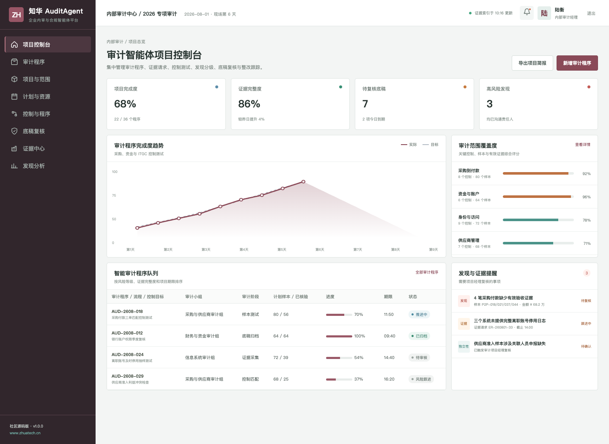
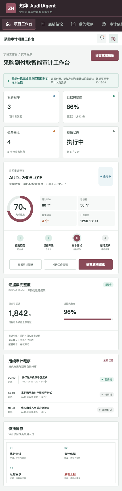

# ZhuaTech AuditAgent

## 企业内审与合规智能体社区源码版

审计的效率来自更好的证据组织，而审计结论仍然来自专业判断。AuditAgent 连接“风险—控制—程序—证据—底稿—发现—整改”，帮助审计人员完成资料索引、样本检查与底稿准备，并对每条建议保留来源和复核状态。

**出品方：上海如静知华信息科技有限公司｜[访问知华科技官网](https://www.zhuatech.cn/)**



## 项目所含模块

| 项目管理端 | 审计人员端 |
| --- | --- |
| 审计项目与范围 | 我的审计程序 |
| 风险控制矩阵 | 证据请求与目录 |
| 计划、资源与里程碑 | 样本测试与偏差记录 |
| 工作底稿分级复核 | 底稿结论提交 |
| 审计发现与整改分析 | 发现升级与沟通 |



核心设计包括证据哈希与来源、只读取证、样本抽取、控制测试、结论草稿、分级复核以及完整审计轨迹。`AgentRuntime` 默认使用本地演示执行器，不访问被审计系统或外部模型。

## 工程信息

Java 包名为 `cn.zhuatech.auditagent`。后端基于 Java 21、Spring Boot、Spring Security、JWT、JPA 与 Flyway；前端基于 Vue 3、Pinia、Vue Router、Axios 与 Vite，兼容桌面和 H5；MySQL 8 用于生产数据，H2 用于测试。

```bash
cd frontend
npm install
npm run dev:demo
```

访问 `http://localhost:5173`，使用 `planner / Demo@2026` 进入项目管理端，使用 `operator / Demo@2026` 进入审计人员端。完整部署方法见 [deploy/README.md](deploy/README.md)。

## 非商业使用声明

本工程仅供个人学习、研究与非商业技术交流，**不得商用**。企业内部使用、生产部署、项目交付、SaaS 服务、付费培训、商业再分发或品牌替换等，须先取得上海如静知华信息科技有限公司书面授权；以 [LICENSE](LICENSE) 为准。

如需内审智能体深度开发、私有化部署、数据连接或商业授权，请访问[知华科技官网](https://www.zhuatech.cn/)或通过微信咨询。

| 技术咨询 | 商务咨询 |
| --- | --- |
|  |  |

搜索关键词：审计智能体、Audit Agent、内部审计系统源码、合规智能体、审计底稿、控制测试、Java Vue 审计系统、知华科技。
